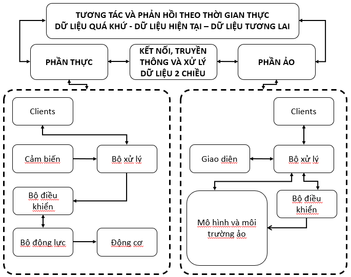

# Digital Twin For Robot Arm 2 Dof

This repository presents a conceptual about digital copies of robot arm 2 dof. The data of physical and virtual robot is transmitted bidirectionally in real time. That helps virtual robots and real robots to be synchronized with each other. 

The system uses technologies and platforms including: Unity 3D, IOT, ROS, MongoDB, Solidwords, Blender, Revit.

This conceptual is applicable to all physical systems as long as you can collect data from them.

# Overview

The system consists of 3 main parts: virtual part, real part and connected part.

## Task

### I. Build robot arm 2 dof
  1. Requirements of the robot
  2. Selection of motors and dynamic circuits
  3. Calculation of mechanical design
  4. Build controller for robot

### II. Build digital twin
  1. Build 3D models of robots
  2. Build virtual environments
  3. Build user interfaces and controller 

### III. Connecting and processing data
  1. Build proceeser center
  2. Selecting a communication protocol
  3. Build the processor
  4. Build a storage system
  5. Build a notification system

### IV. System Evaluation
  1. Select evaluation method
  2. Evaluation Kinetic
  3. Evaluation latency
  4. Evaluation error